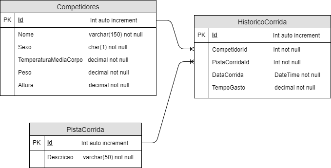

# Desafio Qyon
Este repositório foi desenvolvido durante a codificação do desafio da Qyon para desenvolvedores, utilizando ReactJS para frontend.

## O Desafio
Neste desafio, o desenvolvedor deve criar um sistema de controle de competições de corrida, que armazena o registro de competidores e o histórico de corridas (em cada pista) que cada competidor participou. Abaixo, sera possível visualizar o MER das tabelas para o banco de dados:

    

## Requistos funcionais
Abaixo, seguem os requisitos funcionais do desafio a serem cumpridos:

* [ ] Deverá conter o cadastro completo (CRUD) dos competidores.

* [ ] Deverá conter o cadastro completo (CRUD) das pistas.

* [ ] Deverá conter o cadastro (inclusão e alteração) do histórico de corrida para os competidores.

* [ ] O sistema deverá conter a listagem de quais pistas já foram utilizadas.

* [ ] O sistema deverá conter a listagem dos competidores com o tempo médio gasto nas corridas.

* [ ] O sistema deverá conter a listagem dos competidores que não fizeram nenhuma corrida.

* [ ] O sistema deverá conter a listagem dos competidores que não fizeram nenhuma corrida.

## Requisitos não funcionais
Abaixo, seguem os requisitos não funcionais a serem cumpridos:

* [ ] O Backend deverá ser via REST API (Pode ser realizado utilizando json.server);

* [ ] O Frontend deve ser feito via ReactJS.